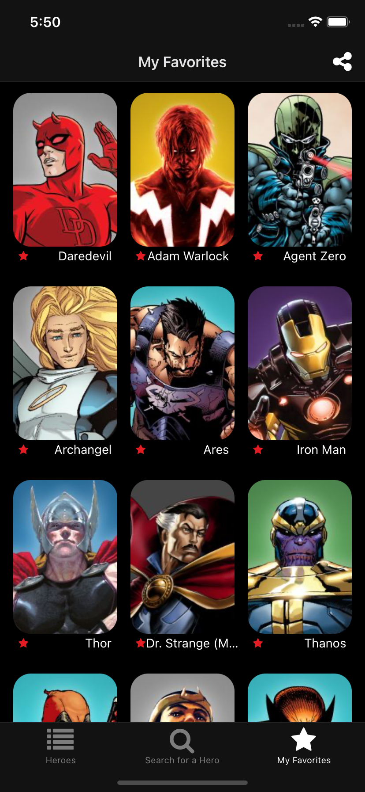
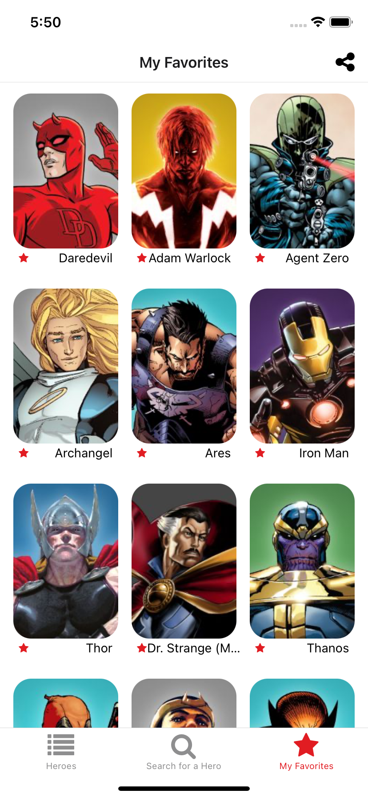

# marvel-heroes-app
Marvel character listing app, using the Marvel API (http://developer.marvel.com)
<p align="left">
  
  
</p>

### Behaviour
The user can:
* View a list of Marvel characters;
* Save favorite characters;
* Show favorite characters;
* Search for some character text.
* Share (text) character.
* Share (text) list of favorite characters;

### API key
To run the application, you must first replace it in the file [config.ts](config.ts), with your public and private key, obtained from the Marvel developer website: https://developer.marvel.com/

### To run
```
yarn install
expo start
```
